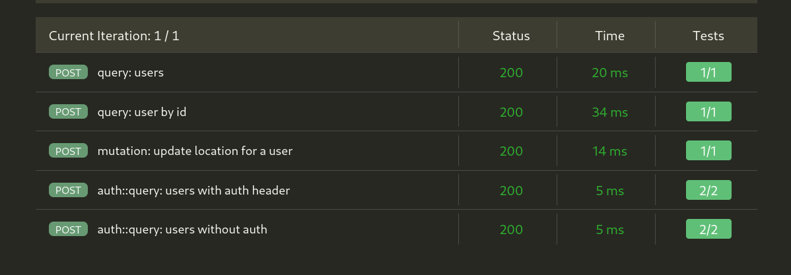

# express-graphql

> sample graphQL using schema-first approach 

## How to run

Install the project dependencies using correct nodejs version.
Install nvm to get the right nodejs version
```
nvm use
npm install --
```

start local postgres instance in a docker container and initialize it with sample data

```
npm run dev:db
npx prisma db seed
```

once database is up and running you can see and play with data from browser using the following command
```
npx prisma studio
```

**NOTE:** Kindly create a copy of `.env` file from sample `.env-template` file and update values as per needs.
Finally, start the graphQL server using
```
npm start
```

this would expose the following 2 API Endpoints

endpoint  | description
----------|------------------------------------------------------
http://localhost:4000/graphql      | without authorization check
http://localhost:4000/auth         | with some authorization checks

## Api Tests




## Tools and Tech used

This project uses following tools and technologies

1. [Apollo graphQL server](https://www.apollographql.com/docs/apollo-server/)
2. [Prisma](https://www.prisma.io/) as ORM layer
3. docker to run local postgres instance
4. API test are recorded on Thunder-Client, json file inside `/docs`
5. [Expressjs](https://expressjs.com/) as production ready app server 

### Improvements

1. [ ] I have used schema-first appraoch in this project. For bigger graphQL APIs it would be valuable to use more code-first appraoch to build and maintain graphQL schema
2. [ ] express.js is solid contender for small to medium sized APIs devvelopment and manitenance. [NestJS](https://nestjs.com/) could be used to write more complex backend APIs with scales better in terms of maintenability and redability
3. [ ] Write CRUD operations using queries and mutations
4. [ ] api unittest could be written on top of integration
5. [ ] proper [JWT token](https://jwt.io/) could be used to secure the api
6. [ ] Everything could be strongly typed for TS benefits
7. [ ] could setup CI/CD pipelines to help with future development workflows

### @ Reach Me @

> available for new opportunity ...

* [Github](https://github.com/avimehenwal/)
* [My Website](https://avimehenwal.in)
* [My Blog](https://avimehenwal2.netlify.app/)
* [Twitter Handle](https://twitter.com/avimehenwal)
* [LinkedIn](https://in.linkedin.com/in/avimehenwal)

<a href="https://www.buymeacoffee.com/F1j07cV" target="_blank"></a>

 Spread Love :hearts: and not :no_entry_sign: hatred   [](https://twitter.com/avimehenwal)